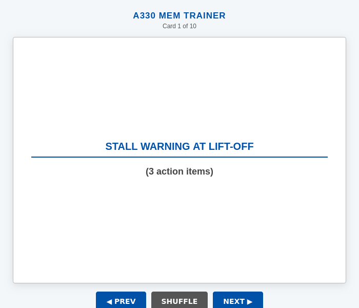
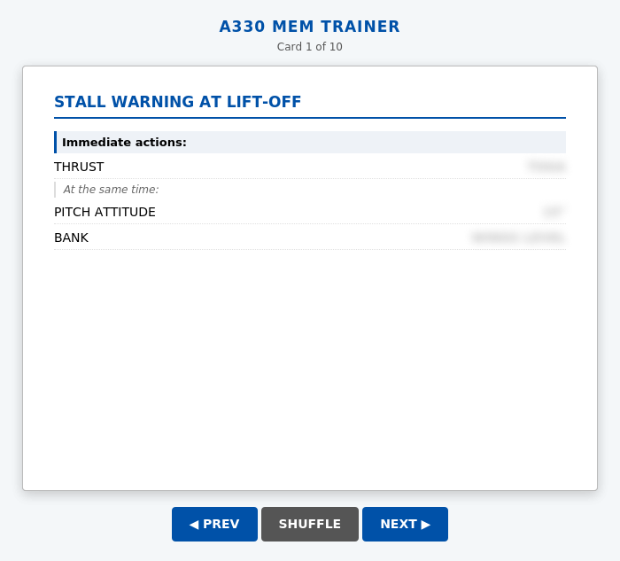
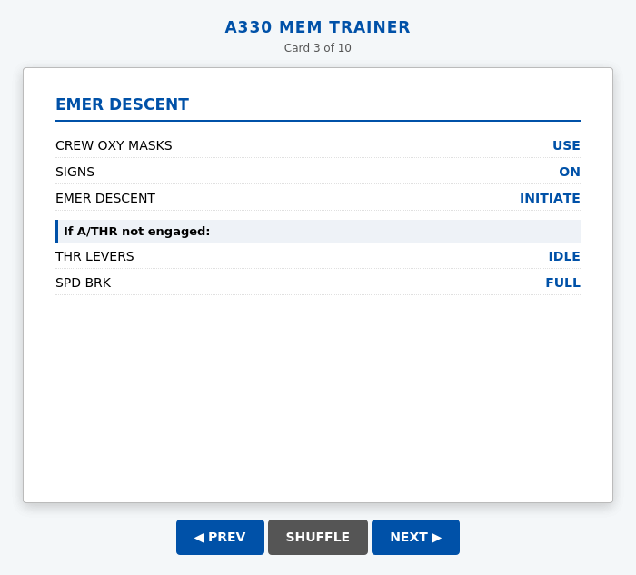

# A330 Memory Item Trainer

A mobile-friendly flashcard app for practicing Airbus A330 memory items (emergency/abnormal procedures that must be performed from memory without reference to the QRH).

## Live Demo

[**Open the trainer →**](https://alejandrozarco.github.io/a330-memory-trainer/)

## Screenshots

| Card front | Back — answers blurred | Back — answers revealed |
|:---:|:---:|:---:|
|  |  |  |

## Memory Items Covered

| # | Procedure |
|---|-----------|
| 1 | Stall Warning at Lift-Off |
| 2 | Stall Recovery |
| 3 | Emergency Descent |
| 4 | Loss of Braking |
| 5 | Unreliable Speed Indication |
| 6 | TAWS Caution |
| 7 | TAWS Warning |
| 8 | TCAS Caution — Traffic Advisory (TA) |
| 9 | TCAS Warning — Resolution Advisory (RA) |
| 10 | Windshear Warning — Reactive Windshear |

## How to Use

1. **Tap / click** the card front to flip it and see the checklist
2. **Tap / click** the back once to reveal all answers at once
3. **Right-click** (desktop) to reveal answers one at a time
4. **Arrow keys** to navigate between cards, **Space / Enter** to flip
5. **Shuffle** to randomise the card order

## Usage

No build step required — open `index.html` directly in any modern browser, or serve it from any static host.
